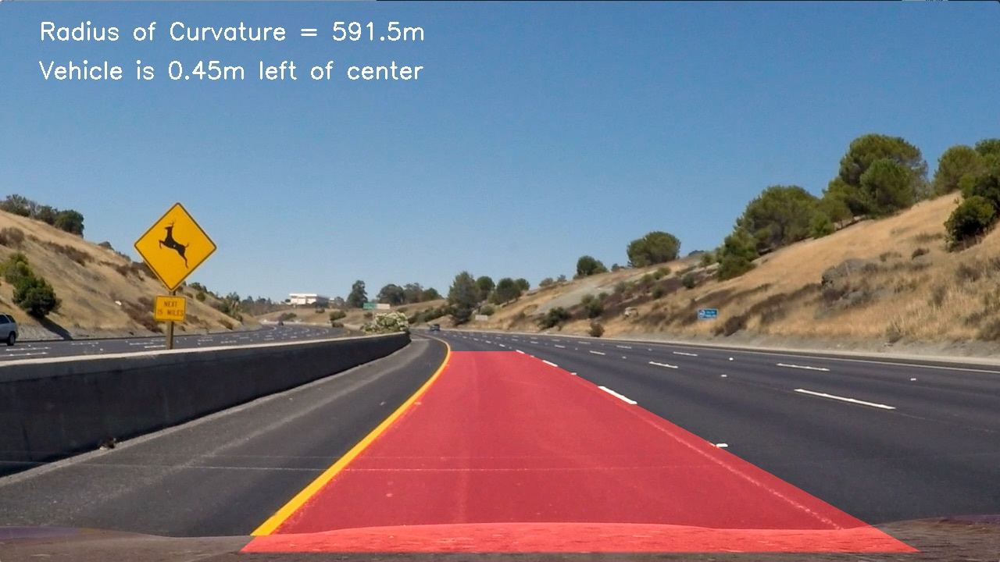
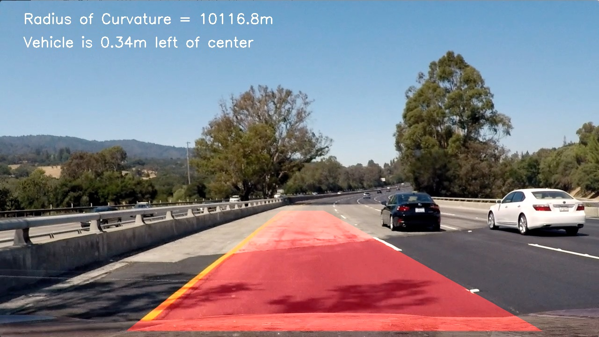

## Writeup

**Advanced Lane Finding Project**

Advanced lane finding project has been broken down into steps shown below:

1. [PreProcessing](Advanced_LaneFinding%20-%20PreProcessing.ipynb)
    - Calibrate camera
    - Perspective transform

    *These values are specific to the camera, installation setup and are saved into a pickle file for reuse in the main pipeline. We will be creating separate pickle files per video.*

2. [Main](Advanced_LaneFindingClass.ipynb)
    - Gradient, color filters
    - Undistort, unwarp
    - Find lane pixels & Fit lane polynomials
    - Compute radius of curvatures
    - Verify lanes & Create best fit using hisory
    - Draw best fit lanes

    *Note: Development & debugging for Main pipeline was done using [Advanced_LaneFinding - Main.ipynb](Advanced_LaneFinding%20-%20Main.ipynb). Final pipeline was implemented using look back and weighted averaging at [Advanced_LaneFindingClass.ipynb](Advanced_LaneFindingClass.ipynb)

Now let's look at each step in detail

**1.1 PreProcessing - Calibrate Camera**
- Chessboard images provided in "camera_cal/*" were used to compute distortion, camera matrix. This involves finding chessboard corners using cv2 and comparing against grid spacing. Original camera images, undistorted images for 2 examples are shown below (You can notice curved lines in the original image and straight lines in the undistorted image)

**1.2 PreProcessing - Perspective Transform**
- This step involves extracting lane lines on a straight road and then computing these straight lane lines after the transform. Lane finding code from previous project ([SimpleLaneFinding.simple_line_finding()](./SimpleLaneFinding.py)) was reused to identify lane lines needed to compute perspective transform matrix (warp matrix). 

*Note: Once the lane lines were identified, 4% to 94% of the lane lines were used for the transformation. Using the whole lanes results in exaggerated warping and trimming the lines too much results in shorter lanes. This appears to be the sewwt spot for this camera setup.*

**Lane Lines before transform (using simple lane finding)** 

**Original Image (left), Undistorted Warped Image (right)** 

**2.1 Main - Gradient Filter, Color Filters**
- Convert to HLS
- Detect yellow pixels and replace with white (this allows us to use a higher threshold for gradient)
- Calculate gradient along x. Normaize and filter
- Apply s, l - channel filters

**Image before gradient, color filters** 

**L-Channel with yellow lane** 

**Yellow pixels** 

**L-Channel with yellow replaced** 

**S-Channel** 

**Gradient, color filters applied. Lane lines are clear and distinct.** 

**2.2 Main - Undistort, Unwarp** 
- Load distortion, warp matrices from pkl file and apply to images. See example of original image and undistorted, unwarped image below:
, Undistorted, Unwarped(right)")

**Gradient filter, color filters, undistorted, unwarped image** 

**2.3 Main - Find lane pixels & Fit polynomials** 
- Compute histogram of the bottom half of the image. Find left, right lane peaks from histogram and move up the window with a set margin to identify lane pixels per window. Finally, use all the lane pixels to fit a 2nd degree polynomial as shown below: 

**Warp lanes back and overplot on raw image. The above test image with detected lane is shown below.** 

**2.4 Main - Compute radius of curvatures** 
- Radius of curvate is calculated using the formula below:

**Rcurve = ( (1 + (2Ay + B)2) 3/2) / (2|A|)** 
where **f(y)=Ay2 + By + C** is the equation of the polynomial.

**2.5 Main - Verify lanes & Create best fit using hisory**
- Once we identify lane, this information can be used to limit the region in which to search for lane pixels. A margin of 100 pixels surrounding previous lane lines appears to work best.
- For every new frame, new lanes are extracted and radius of lane lines, width of lane lines are computed. These parameters can be used to validate the new lane detected. The thresholds used are listed below
    - Radius of curvature ratio < 2.5x  (when radius < 1000)
    - Lane base width within ~19% of nominal (3.7m)
    - Minimum lane width of 2m. (A lower value was chosen here to accomodate for warped lanes at the top of the image)
- If identified lane passes validation checks, it is appended to history
- A weighted average (linear weights with the most recent detection having the highest weight) with n_history(=25) detections is used to compute current lane, radius. If validation was not passed None is added to history and this is ignored for calculations

**2.6 Main - Draw best fit lanes**
- Best fit lanes from previous step are overlayed on the raw image.
- Mean radius and offset from center are calculated and printed on each frame.

**TEST IMAGES** 

[**PROJECT VIDEO OUT**](project_video_out.mp4)

[**CHALLENGE VIDEO OUT**](challenge_video_out.mp4)
